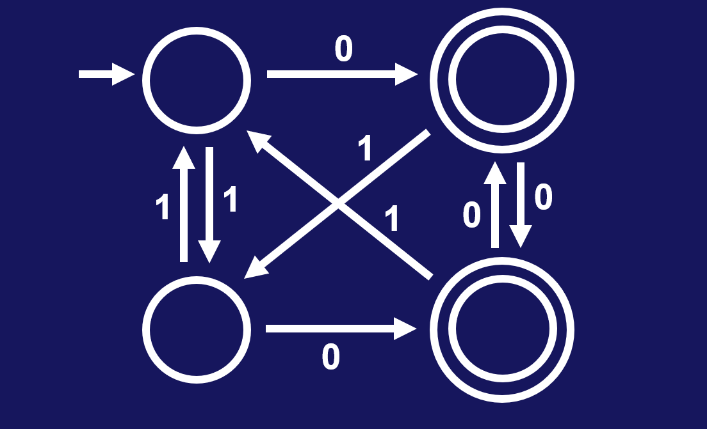
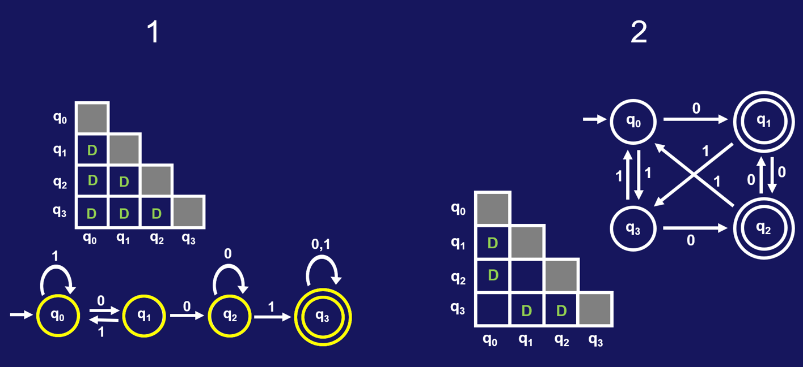
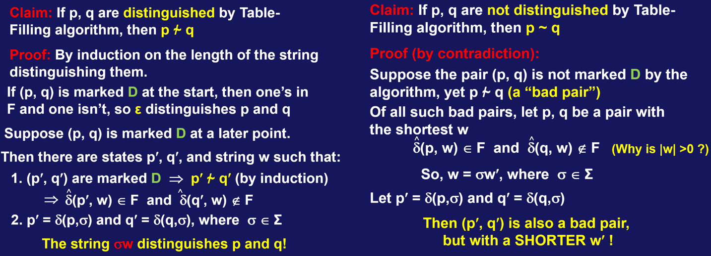

# 04 Minimizing DFAs

当我们面对一个DFA的时候，首先需要关注它的功能或者说它识别的语言；但另一个使人兴致盎然的问题是，当前的DFA是否是最小化的，也就是它是否具有识别目标语言所需的最小状态数。最小化DFA不只是具有理论意义，也跟实践关联紧密。因为很多实际问题都可以转化成通过DFA解决的语言识别问题，最小化的DFA意味着最高的效率。我们在这部分将介绍一个算法，用来最小化DFA。比如，下面两个DFA识别的语言都识别以0结尾的字符串，右边的那个是最小的DFA：

**定理**：对于任何一个正则语言L，存在唯一的最小DFA M，满足 L = L(M)。

这里的唯一是指最小DFA的实际结构唯一，当然你可以给不同的状态重命名，但这个重命名过程不改变最小DFA的唯一性。需要注意的是，这个定理对于NFA不适用。比如下面两个NFA均接受由0构成的字符串，但二者的结构是不一样的：

首先我们对DFA转移函数 $\delta$ 进行扩展，使得原来只读取单个字符的转移函数能够接受字符串。这一扩展是很自然的，因为字符串由多个字符构成，而字符串的转移不过是多个字符转移的链接罢了。扩展的严格定义如下：

给定DFA M = (Q, $\Sigma$, $\delta$, $q_0$, F)，将 $\delta$ 扩展成如下的 $\delta^* : Q \times \Sigma^* \to Q$  

- $\delta^*(q, \varepsilon) = q$ 
- $\delta^*(q, \sigma) = \delta(q, \sigma)$ 
- $\delta^*(q, \sigma_1...\sigma_{k+1}) = \delta(\delta^*(q, \sigma_1...\sigma_k), \sigma_{k+1})$

从定义易知，$\delta^*(q, w)\ \in\ F \Longleftrightarrow M\ accepts\ w$ 。如果存在字符串 $w$ ，使得 $\delta^*(q_1, w)\ \in\ F$ 且 $\delta^*(q_2, w)\ \notin\ F$ ，则我们称字符串 $w$ **区分(distinguishes)**状态 $q_1$ 和 $q_2$ ，或者称 $q_1$ 和 $q_2$ 是**可区分的(distinguishable)**。反之，如果对任意字符串 $w$ ，有 $\delta^*(q_1, w)\ \in\ F$ 当前仅当 $\delta^*(q_2, w)\ \in\ F$ ，我们称 $q_1$ 和 $q_2$ 是**不可区分的(indistinguishable)**，表示为 $q_1$ ~ $q_2$。直觉上来说，对于两个状态 $q_1$ 和 $q_2$ ，当读取某个字符串 $w$ 后，如果它们一个处于接受状态，另一个处于拒绝状态，则显然二者的作用是不同的。由于最小DFA是唯一的，所以我们从任何一个DFA出发，只要能不断地缩减状态数量，就能得到最小DFA。而最小DFA满足的条件，就是其中任意两个状态都是可区分的(distinguishable)。

我们以下面的DFA为例，讨论其各个状态之间的关系。

- $q_0$ 和 $q_1$ 是可区分的，因为空字符串 $\varepsilon$ 区分接受状态和拒绝状态。
- $q_0$ 和 $q_3$ 是可区分的，因为 $\delta^*(q_0, 10)\ \in\ F$ 而 $\delta^*(q_3, 10)\ \notin\ F$ 。
- $q_1$ 和 $q_2$ 是可区分的，因为 $\delta^*(q_1, 0)\ \in\ F$ 而 $\delta^*(q_2, 0)\ \notin\ F$ 。

- 左侧的两个状态和右侧的两个状态都是不可区分的，因为它们读取任一字符串后，转移得到的状态要么均为接受状态，要么均为拒绝状态。

## 最小化算法

由不可区分(indistinguishable)定义的关系 **~** ，是一个等价关系。它将DFA中的状态，划分成多个等价类，这个划分就是我们最小化DFA的直觉启示。因为既然这个等价类中的状态都是不可区分的，它们的功能都是一样的，那我们只需选择其中一个状态就够了。我们将介绍一个最小化DFA的算法MINIMIZE，下面是该算法IO结构：

**Algorithm** MINIMIZE

**Input:** DFA M

**Output:** DFA $M_{MIN}$ such that: 

- $M\equiv M_{MIN}$ (that is, $L(M)=L(M_{MIN})$ )
- $M_{MIN}$ has no inaccessible states
- $M_{MIN}$ is irreducible all states of $M_{MIN}$ are pairwise distinguishable

**定理**：$M_{MIN}$ 就是唯一的最小化DFA。要证明这个定理，我们必须说明：

Suppose M' $\equiv$ M, then

- \# states in M' $\geq$ \# states in M~MIN~ 
- If \# states in M' = # states in M~MIN~ then M' is isomorphic to M~MIN~ (i.e. same up to re-labeling of states)

### Table-Filling Algorithm

对于不可达的状态，我们是很容易找到并剔除的，因此关键的问题就是如何找出不可区分或者说等价的状态对。为此，我们引入算法**Table-Filling Algorithm**，因为该过程借助三角表格标记两两状态之间的可区分性。如果两个状态之间是可区分的，我们就在对应的格子里标记D。首先我们从基础情况开始，找出空字符串 $\varepsilon$ 能区分的状态对：接受状态与拒绝状态。然后是递归的步骤：如果存在 $\sigma \in \Sigma$ 和可区分的状态对(p', q') ，满足 $\delta(p, \sigma)=p'$ 且 $\delta(q, \sigma)=q'$，则状态对(p, q)也是可区分的。重复上述递归步骤，直到不能再标记新的状态对为止。最终，未被标记的状态对就是不可区分的。实际上，如果存在无法区分的状态对，那么这些状态对在读取某个输入字符后，转移的结果仍然在这些无法区分的状态对内部。类似的，可区分的状态对读取输入字符后，转移的结果仍然在这些可区分状态对的内部。下面是两个例子：

Table-Filling Algorithm的正确性还是比较显然的，但是我们这里仍然严谨地给出证明。这是当且仅当的关系，所以证明有两个方面：被Table-Filling Algorithm标记为D的状态对是可区分的；未被Table-Filling Algorithm标记为D的状态对是不可区分的。

