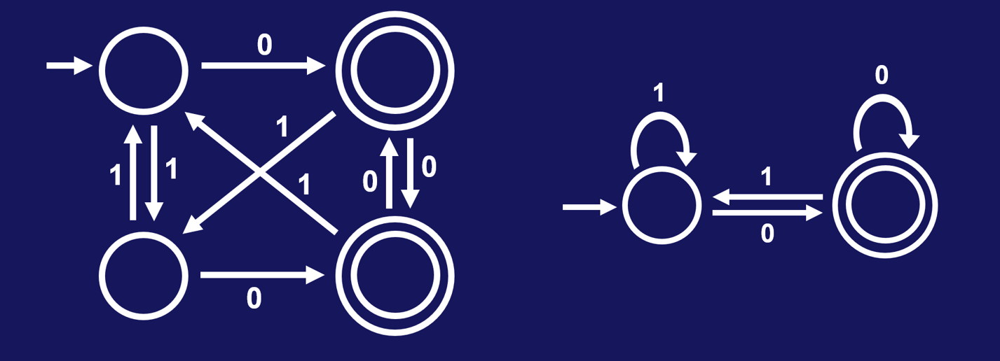
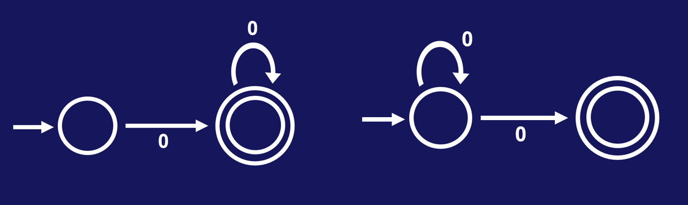
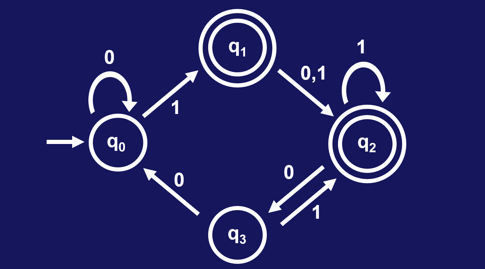

# 04 Minimizing DFAs

当我们面对一个DFA的时候，首先需要关注它的功能或者说它识别的语言；但另一个使人兴致盎然的问题是，当前的DFA是否是最小化的，也就是它是否具有识别目标语言所需的最小状态数。我们在这部分将介绍一个算法，用来最小化DFA。比如，下面两个DFA识别的语言都识别以0结尾的字符串，右边的那个是最小的DFA：

**定理**：对于任何一个正则语言L，存在唯一的最小DFA M，满足 L = L(M)。

这里的唯一是指最小DFA的实际结构唯一，当然你可以给不同的状态重命名，但这个重命名过程不改变最小DFA的唯一性。需要注意的是，这个定理对于NFA不适用。比如下面两个NFA均接受由0构成的字符串，但二者的结构是不一样的：

首先我们对DFA转移函数 $\delta$ 进行扩展，使得原来只读取单个字符的转移函数能够接受字符串。这一扩展是很自然的，因为字符串由多个字符构成，而字符串的转移不过是多个字符转移的链接罢了。扩展的严格定义如下：

给定DFA M = (Q, $\Sigma$, $\delta$, $q_0$, F)，将 $\delta$ 扩展成如下的 $\delta^* : Q \times \Sigma^* \to Q$  

- $\delta^*(q, \varepsilon) = q$ 
- $\delta^*(q, \sigma) = \delta(q, \sigma)$ 
- $\delta^*(q, \sigma_1...\sigma_{k+1}) = \delta(\delta^*(q, \sigma_1...\sigma_k), \sigma_{k+1})$

从定义易知，$\delta^*(q, w)\ \in\ F \Longleftrightarrow M\ accepts\ w$ 。如果存在字符串 $w$ ，使得 $\delta^*(q_1, w)\ \in\ F$ 且 $\delta^*(q_2, w)\ \notin\ F$ ，则我们称字符串 $w$ **区分(distinguishes)**状态 $q_1$ 和 $q_2$ 。直觉上来说，对于两个状态 $q_1$ 和 $q_2$ ，当读取某个字符串 $w$ 后，如果它们一个处于接受状态，另一个处于拒绝状态，则显然二者的作用是不同的。由于最小DFA是唯一的，所以我们从任何一个DFA出发，只要能不断地缩减状态数量，就能得到最小DFA。而最小DFA满足的条件，就是其中任意两个状态都是**可区分的(distinguishable)**。我们以下面的DFA为例，讨论其各个状态之间的关系。

